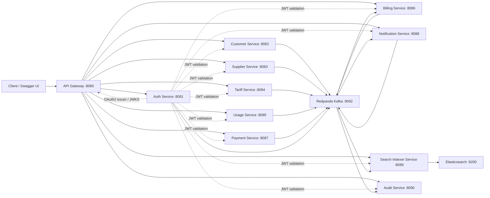

# EnergyPal

EnergyPal is a Java 17+ Spring Boot 3 microservices case-study platform for energy supplier management. It is implemented in Java only; there is no .NET dependency.

The solution demonstrates a multi-module Maven build, Spring Boot REST APIs, OAuth2/JWT security, Swagger/OpenAPI, Kafka-compatible eventing with Redpanda, Elasticsearch indexing, Docker Compose deployment, and a console assignment app with deterministic input/output.

## Review Status

The codebase was reviewed and verified on June 1, 2026.

Verified commands:

```powershell
mvn verify
```

Result:

```text
BUILD SUCCESS
```

The Maven build runs all tests and enforces the configured JaCoCo `0.90` line coverage gate.

Console input/output was also verified with:

```powershell
$commands = @(
  "input plans.json",
  "annual_cost 1000",
  "annual_cost 2000",
  "exit"
) -join [Environment]::NewLine

$commands | mvn -q -pl console-app exec:java "-Dexec.mainClass=com.energypal.console.ConsoleApplication"
```

Expected output:

```text
energyOne,planOne,108.68
energyThree,planThree,111.25
energyTwo,planTwo,120.22
energyFour,planFour,121.33
energyThree,planThree,205.75
energyOne,planOne,213.68
energyFour,planFour,215.83
energyTwo,planTwo,235.72
```

## Services

| Module | Port | Responsibility |
| --- | ---: | --- |
| `api-gateway` | 8080 | Gateway routing and JWT resource-server enforcement |
| `auth-service` | 8081 | Registration, login, OAuth2 Authorization Server, JWKS |
| `customer-service` | 8082 | Customer profile APIs |
| `supplier-service` | 8083 | Supplier APIs |
| `tariff-service` | 8084 | Energy tariff APIs and comparison |
| `usage-service` | 8085 | Meter reading APIs and usage events |
| `billing-service` | 8086 | Bill APIs and usage-event billing listener |
| `payment-service` | 8087 | Payment APIs and payment events |
| `notification-service` | 8088 | Notification APIs and event listener |
| `search-indexer-service` | 8089 | Kafka-to-Elasticsearch indexing and search APIs |
| `audit-service` | 8090 | Kafka event audit trail |
| `console-app` | n/a | Assignment console commands: `input`, `annual_cost`, `exit` |
| `common` | n/a | Shared API response, event, OpenAPI, and security support |

## Technology

- Java 17 or later
- Spring Boot 3.3.7
- Spring Cloud Gateway
- Spring Security OAuth2 Authorization Server and Resource Server
- Spring Data JPA with H2 local databases
- Spring Kafka
- Elasticsearch
- Redpanda as the Kafka-compatible broker in Docker
- Maven multi-module build
- JaCoCo coverage gate at 90% line coverage
- Swagger/OpenAPI through Springdoc

## Architecture



## Design Review Notes

The codebase is intentionally compact for case-study evaluation. The core implementation uses constructor-based dependency injection, repository abstractions, shared event contracts, shared response envelopes, and Spring-managed components.

Strengths visible in the code:

- Java 17 records and immutable value-style DTOs are used where appropriate.
- Dependencies are injected through constructors.
- Event publishing is abstracted behind `EventPublisher`.
- Shared cross-cutting concerns live in the `common` module.
- Tests are present in every module and the Maven build enforces the coverage threshold.
- Docker mode gives a complete integration environment with Kafka-compatible messaging and Elasticsearch.

Production hardening areas:

- `auth-service` stores demo users in memory. A production system should persist users in a database.
- Demo OAuth client credentials are committed for reviewer convenience. Production credentials should come from a secret manager.
- Request validation is intentionally light. Production APIs should add Bean Validation annotations, error mapping, and stricter request schemas.
- The services are compact single-file examples per domain. A larger production codebase would split controllers, services, repositories, entities, DTOs, and configuration into separate packages.
- Docker Compose starts infrastructure for evaluation, not for highly available production deployment.

## Run Modes

There are two supported run modes.

| Mode | Command | Use When |
| --- | --- | --- |
| Core local mode | `.\run_without_docker.bat` | Employer does not have Docker, Kafka, or Elasticsearch |
| Full Docker mode | `.\run_with_docker.bat` | Employer wants to evaluate Kafka, Elasticsearch, and all services |

Matching stop commands:

```powershell
.\stop_without_docker.bat
.\stop_with_docker.bat
```

Long descriptive script names are also included:

```text
start_local_without_kafka_elasticsearch_docker.bat
stop_local_without_kafka_elasticsearch_docker.bat
start_local_with_kafka_elasticsearch_docker.bat
stop_local_with_kafka_elasticsearch_docker.bat
```

## Prerequisites

For all modes:

```powershell
java -version
mvn -version
```

Java must be version 17 or later.

For full Docker mode:

```powershell
docker --version
docker compose version
```

## IntelliJ One-Click Run

The `.run` folder contains shared IntelliJ run configurations:

| Run Configuration | Purpose |
| --- | --- |
| `start_local_without_kafka_elasticsearch_docker` | Build and run core local services without Docker |
| `stop_local_without_kafka_elasticsearch_docker` | Stop core local services |
| `start_local_with_kafka_elasticsearch_docker` | Build and run full Docker stack |
| `stop_local_with_kafka_elasticsearch_docker` | Stop full Docker stack |

Steps:

1. Open IntelliJ IDEA.
2. Open the project folder, for example `D:\EnergyPal`.
3. Wait for Maven import to finish.
4. Set Project SDK to Java 17 or later.
5. Select the required run configuration.
6. Click the green Run button.

## Core Local Mode

Use this mode when Docker, Kafka, and Elasticsearch are not available.

```powershell
cd D:\EnergyPal
.\run_without_docker.bat
```

This starts:

- `auth-service`
- `customer-service`
- `supplier-service`
- `tariff-service`
- `usage-service`
- `payment-service`
- `api-gateway`

This mode intentionally skips:

- `billing-service`
- `notification-service`
- `search-indexer-service`
- `audit-service`

Those skipped services depend on Kafka and/or Elasticsearch. They are available in full Docker mode.

Open after startup:

```text
API Gateway:  http://localhost:8080
Swagger UI:   http://localhost:8080/swagger-ui.html
Auth Service: http://localhost:8081
```

Stop:

```powershell
.\stop_without_docker.bat
```

## Full Docker Mode

Use this mode for complete evaluation with Redpanda Kafka and Elasticsearch.

```powershell
cd D:\EnergyPal
.\run_with_docker.bat
```

The script performs:

- Java, Maven, Docker, and Docker Compose checks
- `mvn clean package`
- `docker compose up --build -d`
- Auth and Gateway health checks
- A registration smoke test through the API Gateway

Open after startup:

```text
API Gateway:    http://localhost:8080
Swagger UI:     http://localhost:8080/swagger-ui.html
Auth Service:   http://localhost:8081
Elasticsearch:  http://localhost:9200
Kafka broker:   localhost:9092
```

Optional tools:

```powershell
docker compose --profile tools up -d
```

| Tool | URL |
| --- | --- |
| Kafka UI | http://localhost:8099 |
| Kibana | http://localhost:5601 |

Stop:

```powershell
.\stop_with_docker.bat
```

## Build And Test

Build everything:

```powershell
mvn clean package
```

Run all tests and coverage verification:

```powershell
mvn verify
```

Coverage reports are generated under:

```text
<module>/target/site/jacoco/index.html
```

## Console Assignment

Run interactively:

```powershell
mvn -q -pl console-app exec:java "-Dexec.mainClass=com.energypal.console.ConsoleApplication"
```

Then enter:

```text
input plans.json
annual_cost 1000
annual_cost 2000
exit
```

One-command verification:

```powershell
$commands = @(
  "input plans.json",
  "annual_cost 1000",
  "annual_cost 2000",
  "exit"
) -join [Environment]::NewLine

$commands | mvn -q -pl console-app exec:java "-Dexec.mainClass=com.energypal.console.ConsoleApplication"
```

Expected output:

```text
energyOne,planOne,108.68
energyThree,planThree,111.25
energyTwo,planTwo,120.22
energyFour,planFour,121.33
energyThree,planThree,205.75
energyOne,planOne,213.68
energyFour,planFour,215.83
energyTwo,planTwo,235.72
```

## Swagger

Swagger UI:

```text
http://localhost:<port>/swagger-ui.html
```

OpenAPI JSON:

```text
http://localhost:<port>/v3/api-docs
```

| Service | Swagger UI |
| --- | --- |
| API Gateway | http://localhost:8080/swagger-ui.html |
| Auth Service | http://localhost:8081/swagger-ui.html |
| Customer Service | http://localhost:8082/swagger-ui.html |
| Supplier Service | http://localhost:8083/swagger-ui.html |
| Tariff Service | http://localhost:8084/swagger-ui.html |
| Usage Service | http://localhost:8085/swagger-ui.html |
| Billing Service | http://localhost:8086/swagger-ui.html |
| Payment Service | http://localhost:8087/swagger-ui.html |
| Notification Service | http://localhost:8088/swagger-ui.html |
| Search Indexer Service | http://localhost:8089/swagger-ui.html |
| Audit Service | http://localhost:8090/swagger-ui.html |

In core local mode, only the core services are started. Billing, notification, search, and audit Swagger pages are available in full Docker mode.

## OAuth2

Auth Service issuer:

```text
http://localhost:8081
```

Discovery and keys:

```text
http://localhost:8081/.well-known/openid-configuration
http://localhost:8081/oauth2/jwks
```

Default reviewer client:

```text
client_id: energypal-client
client_secret: energypal-secret
scopes: energypal.read energypal.write
```

Request a client-credentials token:

```powershell
curl.exe -u energypal-client:energypal-secret `
  -d "grant_type=client_credentials" `
  -d "scope=energypal.read energypal.write" `
  http://localhost:8081/oauth2/token
```

Use the returned `access_token`:

```powershell
curl.exe -H "Authorization: Bearer <access_token>" http://localhost:8080/api/customers
```

Public registration through Gateway:

```powershell
$body = @{
  email = "reviewer@example.com"
  password = "Passw0rd!"
  role = "CUSTOMER"
} | ConvertTo-Json -Compress

curl.exe -H "Content-Type: application/json" `
  -d $body `
  http://localhost:8080/api/auth/register
```

Note: the `/api/auth/register` endpoint returns a demo application token for the sample registration flow. For protected service APIs, use the OAuth2 client-credentials token from `/oauth2/token`.

## Kafka Topics

The shared event contract is `EventEnvelope` in the `common` module.

Topics:

- `customer.events`
- `supplier.events`
- `tariff.events`
- `usage.events`
- `billing.events`
- `payment.events`
- `notification.events`

Example event shape:

```json
{
  "eventId": "uuid",
  "eventType": "BillGenerated",
  "eventVersion": 1,
  "occurredAt": "2026-06-01T10:15:30Z",
  "source": "billing-service",
  "correlationId": "uuid",
  "payload": {
    "billId": "BILL123",
    "customerId": "CUST456",
    "amount": 142.75
  }
}
```

## Example API Calls

Create a customer:

```http
POST http://localhost:8080/api/customers
Authorization: Bearer <access_token>
Content-Type: application/json

{
  "fullName": "Asha Rao",
  "email": "asha@example.com",
  "phone": "9999999999",
  "postcode": "560001",
  "serviceAddress": "MG Road, Bengaluru"
}
```

Create a supplier:

```http
POST http://localhost:8080/api/suppliers
Authorization: Bearer <access_token>
Content-Type: application/json

{
  "name": "GreenGrid Energy",
  "contactEmail": "ops@greengrid.example",
  "serviceArea": "560001",
  "greenEnergy": true
}
```

Create an energy plan:

```http
POST http://localhost:8080/api/tariffs
Authorization: Bearer <access_token>
Content-Type: application/json

{
  "supplierId": "supplier-id",
  "planName": "Green Saver",
  "planType": "FIXED",
  "standingCharge": 12.50,
  "unitRate": 0.32,
  "greenEnergy": true
}
```

Compare plans:

```http
GET http://localhost:8080/api/tariffs/compare?monthlyKwh=350
Authorization: Bearer <access_token>
```

Submit usage:

```http
POST http://localhost:8080/api/usage/readings
Authorization: Bearer <access_token>
Content-Type: application/json

{
  "customerId": "customer-id",
  "readingDate": "2026-06-01",
  "kwh": 350
}
```

Record payment:

```http
POST http://localhost:8080/api/payments
Authorization: Bearer <access_token>
Content-Type: application/json

{
  "billId": "bill-id",
  "customerId": "customer-id",
  "amount": 112.00
}
```

## Employer Evaluation Checklist

- Confirm Java 17+ is installed.
- Run `mvn verify` and confirm `BUILD SUCCESS`.
- Run the console assignment command and compare the expected output.
- Run `.\run_without_docker.bat` if Docker is unavailable.
- Run `.\run_with_docker.bat` for the full Kafka and Elasticsearch stack.
- Open Swagger at `http://localhost:8080/swagger-ui.html`.
- Verify OAuth2 discovery at `http://localhost:8081/.well-known/openid-configuration`.
- Request an OAuth2 client-credentials token and call a protected API through the gateway.
- In Docker mode, inspect Kafka topics/events through logs or optional Kafka UI.
- Review the `common` module for shared event, response, OpenAPI, and security abstractions.
